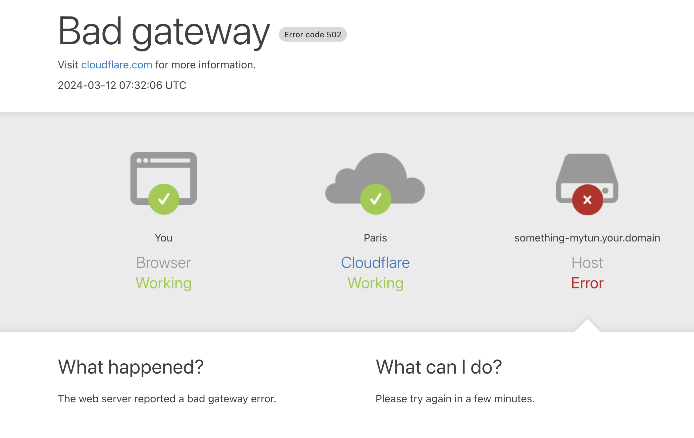

# Example: cloudflared tunnel

Cloudflare implements two ways of tunneling traffic from its edge ip to your local PrestaShop instance:

1. Quick Tunnels
2. Named Tunnels

Only the Named tunnels (2) are supported in this example for now. Feel free to contribute to automatically guess the quick tunnels metrics from PrestaShop Flashlight.

# Setting up

First you have to setup the credentials files:

```bash
cp credentials.dist.json credentials.json
edit credentials.json # replace all AccountTag TunnelSecret and TunnelID
```

And the tunnel domain name you want to open:

```bash
cp .env.dist .env
edit .env # replace the TUNNEL_NAME by your own tunnel domain
```

# Use

Once the configuration is set, you just have to run the docker-compose file:

```
docker compose up
```

# Q&A

> I get a 502 error, what does it mean?

The [502 HTTP code](https://developer.mozilla.org/fr/docs/Web/HTTP/Status/502) stands for bad gateway, and would probably be displayed like:



This means your PrestaShop is not ready or faulty. You may diagnose it from the logs:

```bash
docker logs -f prestashop
```

> How can I get more information on the `cloudflared` CLI?

Call the `--help` command:

```bash
❯ docker run -it --rm cloudflare/cloudflared:latest tunnel run --help
NAME:
  cloudflared tunnel run - Proxy a local web server by running the given tunnel

USAGE:
  cloudflared tunnel [tunnel command options] run [subcommand options] [TUNNEL]
...
```

# Resources

CloudFlare documentation:

- https://developers.cloudflare.com/cloudflare-one/connections/connect-networks/get-started/create-local-tunnel/
- https://developers.cloudflare.com/cloudflare-one/connections/connect-apps/install-and-setup/tunnel-guide/
